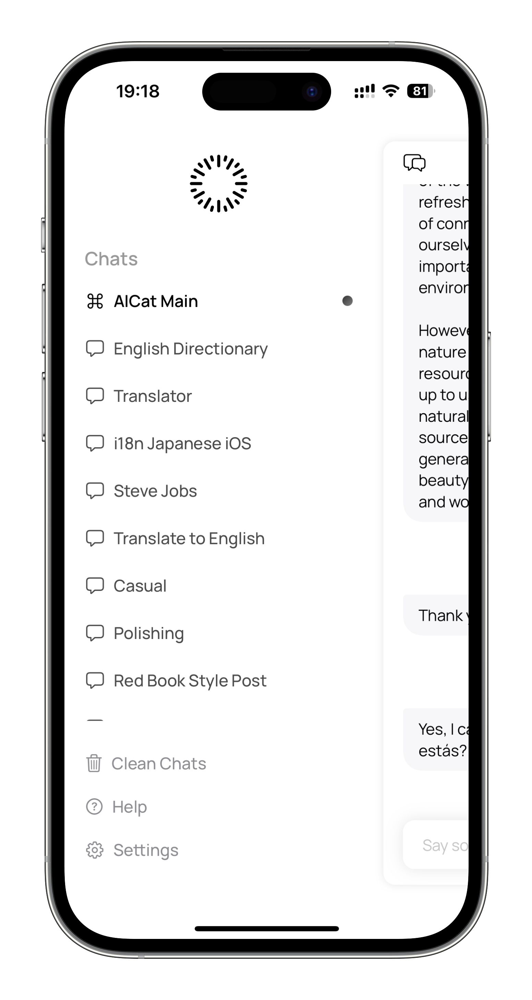
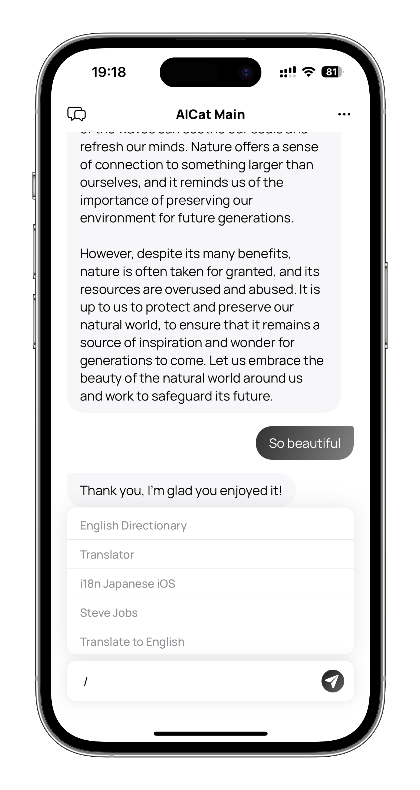
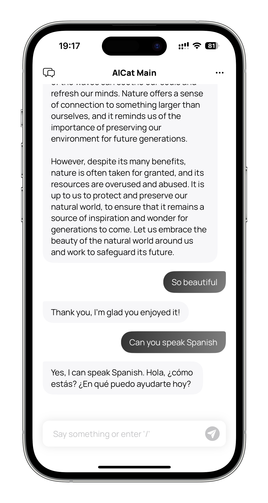
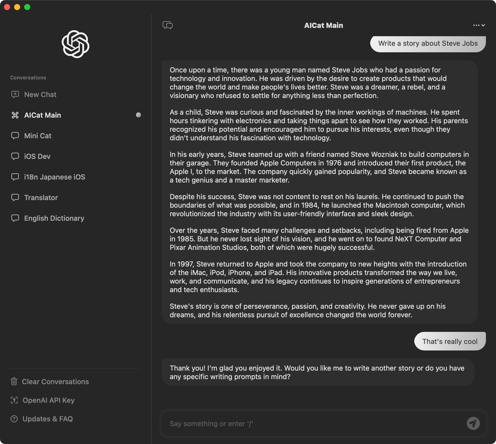
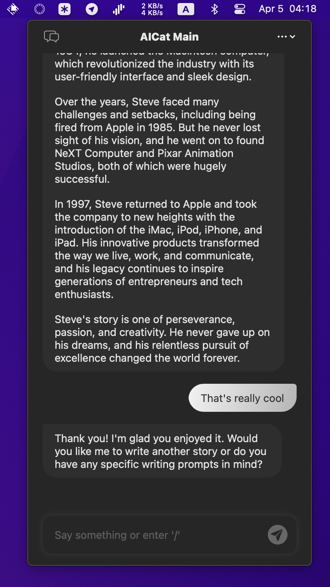

# AICat
> An chat app base on ChatGPT

### Build Requirements
- Xcode 14.3 (Not verified on other version)
- Create Credential.Swift
  ```Swift
  // for App Crash Tracking
  let appCenterSecretKey = "{Your AppCenter App Secret}"
  ```
  [AppCenter](https://appcenter.ms/)

### Features

- [Features of ChatGPT Web App](https://chat.openai.com/chat)
- Create Chat with prompt
- Command mode inspired by Telegram
- Custom some request parameters in Settings
- CRUD for Chat and Messages

> the command mode depends on chats with prompt, creating more prompts is important

### Requirements
- [OpenAI API Key](https://platform.openai.com/account/api-keys)


### Screenshots

- **iOS**
  
 |  | 
---|---|---

- **MacOS**

 | 
---|---
### Download

- [Testflight](https://testflight.apple.com/join/ow799Vvb)