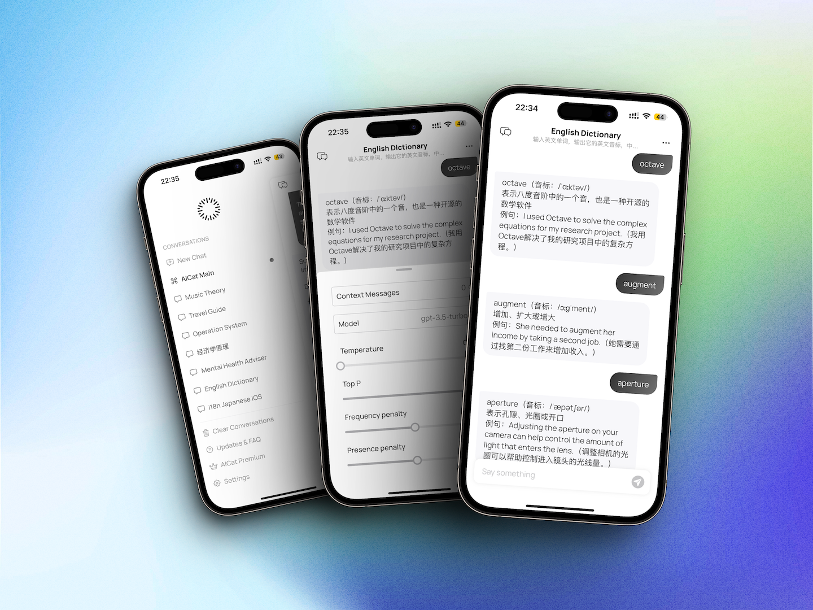

# AICat - Apple Platform Client for ChatGPT

> This project demonstrates how to develop a cross-platform Apple app from scratch using SwiftUI, including network requests, database storage, and in-app purchases. The project was written in a relatively short amount of time, so if you have any questions or suggestions for improvement, please feel free to provide feedback.

### Build
- Xcode 14.3 (Not verified on other version)
- Create Credential.Swift
  ```Swift
  // for App Crash Tracking
  let appCenterSecretKey = "{Your AppCenter App Secret}"
  // for in app purchase
  let appHudKey = "{Your AppHud App Key}"
  // open ai
  let openAIKey = "{Your OpenAI API Key}"
  let proxyAPIHost = "https://api.openai.com"
  let monthlyPremiumId = "monthly premium subscription product id"
  let catFoodId = "consumable in-app purchase product id"
  ```
  - [AppCenter](https://appcenter.ms/)
  - [AppHud](https://apphud.com/)

### Features

- [x] [Features of ChatGPT Web App](https://chat.openai.com/chat)
- [x] Create Chat with prompt
- [x] Command mode inspired by Telegram
- [x] Custom request parameters for every conversation
- [x] CRUD for Chat and Messages
- [x] Use your own OpenAI API Key
- [x] Custom API Host
- [x] Share message as image
- [ ] Export messages as Markdown
- [ ] Copy code block
- [ ] iCloud Sync

> the command mode depends on chats with prompt, creating more prompts is important

### Requirements
- iOS, iPadOS 15 and later version
- macOS 13 and later version

### How to use
- For people who have OpenAI account, you can input [OpenAI API Key](https://platform.openai.com/account/api-keys) to access all features(called developer mode)
- For people who do not have OpenAI API key, subscribe monthly premium to access all features
- Long press version number text for more than 5s in bottom of Settings page to switch developer mode


### Screenshots

- **iOS**
  


- **MacOS**


### Links

- Join [TestFlight](https://testflight.apple.com/join/ow799Vvb)
- Join [AICat News](https://t.me/aicatevents)
- [App Store](https://apps.apple.com/us/app/aicat-ultimate-ai-assistant/id6446479308)